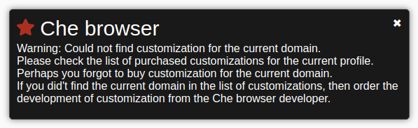

.. |HeavyCheckMark| unicode:: U+2714 .. галочка

Кастомизации
============
.. contents:: Содержание
   :depth: 3

Что это такое?
--------------
Кастомизация - адаптация антидетекта под подмену конкретной реализации того или иного вида отпечатка.

Кастомизация состоит из нескольких частей:

- сбор сэмплов-образцов данных с реальных браузеров (точно таким же кодом как на целевом сайте)
- сэмплы-образцы данных собранные с реальных браузеров
- механизм подмены данных при посещении целевого сайта

Кастомизации могут быть заточены под конкретные сайты (на пример под paypal.com) и массовые, те которые работают на тысячах сайтах.
Как было сказано выше, существуют публичные javascript библиотеки для организации браузерного фингерпринтинга.
Эти библиотеки используются на тысячах сайтах. И кастомизации для этих библиотек включены в каждый профиль по дефолту.
Т.е. при покупке профиля дополнительно ничего не нужно докупать.

Хотя следует отметить, что есть и кастомизации под конкретные сайты.
Список этих кастомизаций постоянно пополняется и обновляется.
Т.к. разработка кастомизаций под конкретные сайты бывает довольно не тривиальной задачей, то они тарифицируются отдельно.
В ближайшее время будет реализован специальный раздел со списком и ценами на кастомизации по конкретным доменам.

Сообщение о том, что кастомизация/сэмплы не найдены
---------------------------------------------------

В процессе работы Вы можете встречать сообщение о том, что  Che browser не смог найти кастомизацию или сэмплы для подмены canvas/audio фингерпринтов.

Это может свидетельствовать о следующем:

- на сайте используется уникальное решение для сбора фингерпринта и требуется разработка кастомизации.
    О разработке кастомизаций читайте ниже.
- Вы забыли приобрести кастомизацию для данного домена в момент покупки профиля.
    При учете того, что под данный домен уже реализована кастомизация и доступна для приобретения.
    Пожалуйста проверьте приобретена ли требуемая кастомизация для используемого профиля.
    Посмотреть это можно в окне **Settings** - настройки профиля.
    В поле **Customizations** рядом с названием требуемого домена должна стоять галочка |HeavyCheckMark|
- установленный в системе google chrome не поддерживает **WebGL1** или **WebGL2**
    Прочитайте пункт документации о тестировании поддержки **WebGL**
- иногда бывает ложное срабатывание.
    На сайте используются какие то методы которые так же могут используются при сборе фингерпринта, но совершенно в других целях.
    На пример для проигрывания звука или отрисовки картинок на canvas.

В любом случае Вы можете просто закрыть сообщение. А работать или не работать дальше зависит от выше описанных пунктов.

Заказать разработку кастомизации
--------------------------------
Вы всегда можете обратиться с вопросом о разработке кастомизации под интересующий Вас сайт.
Все условия и цены обсуждаются в индивидуальном порядке.
Кастомизации могут быть как приватными - не доступны для широкой публики.
Так и паблик - доступны всем пользователям продукта и представлены в общем списке.

