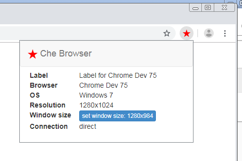
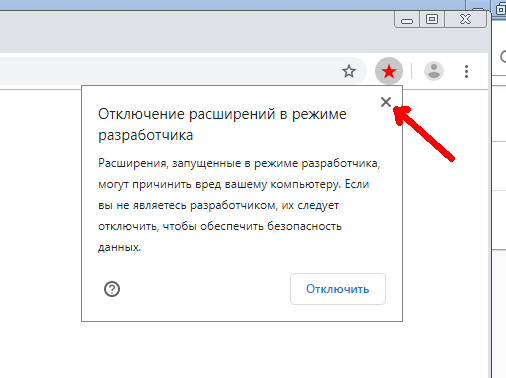

F.A.Q.
======
.. contents:: Содержание
   :depth: 3

Как это все работает?
---------------------
Данный софт состоит из нескольких частей:

- нативное приложение запускаемое на linux или windows
    - Позволяет удобно управлять множеством профилей браузеров
    - Приобретать профили собранные с реальных браузеров
    - Пополнять баланс
    - Продлевать аренду
- расширение для браузера chrome
    - Выполняет подмены различных данных
    - Перехватывает и корректирует разные техники фингерпринта
    - Приминяет кастомизации реализованные под определенные сайты

По этой причине, что бы все завелось, Вам подтребуется установить последнюю версию браузера chrome.
Пожалуйста, устанавливливайте его по дефолту. Это Важно!

Профили
-------
Профиль браузера - это набор самых разнообразных данных, из которых в последствии антифрод системы составляют уникальный отпечаток.

Все предоставляемые нами профили:

 - были собраны с реальных устройств
 - предоставляются только в одни руки
 - не содержат генеренных данных
 - не содержат ГМО ;)

Разрешение экрана
-----------------
На данный момент, реализована подмена данных о разрешении экрана на уровне javascript.

Подмена media queries еще в процессе разработки.

По этой причине, после запуска окно браузера автоматически сворачивается до требуемого размера.

**Не разворачивайте окно браузер** до полного размера! Если же Вы вдруг развернули, то можете воспользоваться кнопкой **set window size**.
Эту кнопку, Вы можете найти, нажав на иконку звездочки, которая обычно располагается рядом с адресной строкой браузера.

Утечка DNS
----------
В chrome браузере имеется не очень приятный баг.
При первом запуске браузера (с новым профилем) DNS трафик периодами начинает течь в обход сокса.
По этой причине, приходится автоматически закрывать окно браузера при первом запуске и перезапускать браузер снова.
Имейте это ввиду и не пугайтесь, когда окно браузера блымает при первом запуске с новым профилем.

Отключение расширений в режиме разработчика
-------------------------------------------
После запуска браузера, chrome может предложить Вам отключить расширение che browser. **Не делайте этого!**
Просто нажмите на крестик в диалоговом окне и работайте дальше.

Почему на browserleaks.com я вижу одинаковые фингерпринты?
-----------------------------------------------------------------
Если при тестировании Вы видете одинаковый фингерпринт (на пример canvas) на разных профилях, то
вероятно Вы еще не прочитали документацию полностью.
Пожалуйста, выделить совсем чуть-чуть времени и сделать это. Начните с раздела :ref:`customization`

Замечу, что на https://browserleaks.com/ используется своя реализация сбора canvas фингерпринта.
Кастомизацию конкретно под https://browserleaks.com/ я не стал реализовывать, т.к. не вижу смысла пускать пыль в глаза.

Попробуйте лучше кастомизацию под bestbuy.com ;)

.. include:: yandex-metrika.rst
